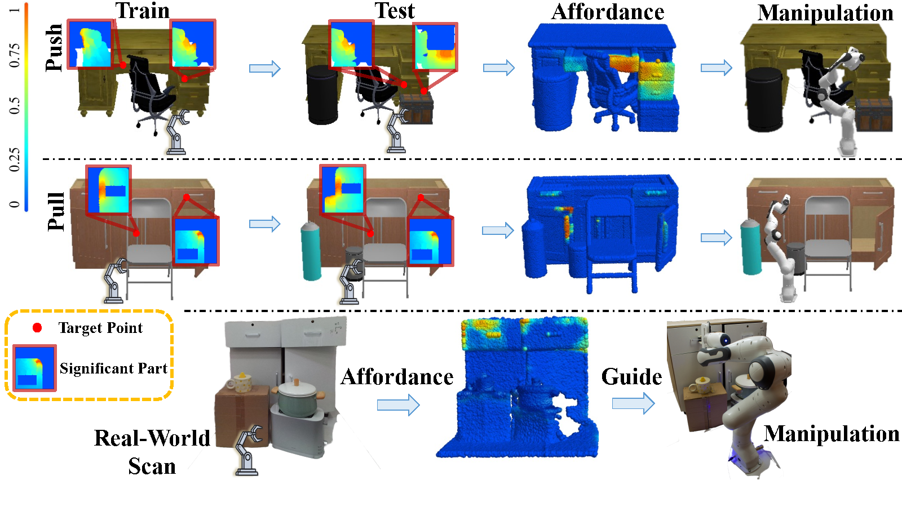

<h2 align="center">
  <b>Learning Environment-Aware Affordance for 3D Articulated Object Manipulation under Occlusions</b>

  <b><i>NeurIPS 2023</i></b>


<div align="center">
    <a href="https://github.com/chengkaiAcademyCity/env_aware_afford" target="_blank">
    </a>
    <a href="https://arxiv.org/pdf/2309.07510.pdf" target="_blank">
    </a>
    <a href="https://chengkaiacademycity.github.io/EnvAwareAfford/" target="_blank">
    </a>
    <a href="https://youtu.be/r88hWcRmQYM" target="_blank">
    </a>
</div>
</h2>

---

This the official repository of the paper **Learning Environment-Aware Affordance for 3D Articulated Object Manipulation under Occlusions** at *NeurIPS 2023*.

For more information, please visit our [project website](https://chengkaiacademycity.github.io/EnvAwareAfford/).




**The Proposed Environment-Aware Affordance.** Considering constraints imposed by the environment and robot for object-centric affordance introduces combinatorial explosion challenge in complexity. Given that target manipulation point (Red Point) conditioned occluder parts that impact the manipulation usually have limited local areas (Red Box), our model can be trained on one-occluder scenes (Train) and generalize to multiple occluder combinations (Test, Affordance).

## Introduction
Perceiving and manipulating 3D articulated objects (e.g., cabinets, doors) in human environments is an important yet challenging task for future home-assistant robots. The space of 3D articulated objects is exceptionally rich in their myriad semantic categories, diverse shape geometry, and complicated part functionality. Previous works mostly abstract kinematic structure with estimated joint parameters and part poses as the visual representations for manipulating 3D articulated objects. In this paper, we propose object-centric actionable visual priors as a novel perception-interaction handshaking point that the perception system outputs more actionable guidance than kinematic structure estimation, by predicting dense geometry-aware, interaction-aware, and task-aware visual action affordance and trajectory proposals. We design an interaction-for-perception framework VAT-Mart to learn such actionable visual representations by simultaneously training a curiosity-driven reinforcement learning policy exploring diverse interaction trajectories and a perception module summarizing and generalizing the explored knowledge for pointwise predictions among diverse shapes. Experiments prove the effectiveness of the proposed approach using the large-scale PartNet-Mobility dataset in SAPIEN environment and show promising generalization capabilities to novel test shapes, unseen object categories, and real-world data.

## About the paper

Our paper is accepted to NeurIPS 2023!

Our team: 
[Kai Cheng*](https://chengkaiacademycity.github.io/),
[Ruihai Wu*](https://warshallrho.github.io/),
[Yan Shen](https://sxy7147.github.io/),
[Chuanruo Ning](https://tritiumr.github.io/),
[Guanqi Zhan](https://championchess.github.io/),
and [Hao Dong](https://zsdonghao.github.io/)
from 
Peking University and University of Oxford.

Arxiv Version: https://arxiv.org/abs/2309.07510

Project Page: https://chengkaiacademycity.github.io/EnvAwareAfford/

## Citations
    
    @inproceedings{cheng2023learning,
      title={Learning Environment-Aware Affordance for 3D Articulated Object Manipulation under Occlusions},
      author={Cheng, Kai and Wu, Ruihai and Shen, Yan and Ning, Chuanruo and Zhan, Guanqi and Dong, Hao},
      booktitle={Advances in Neural Information Processing Systems (NeurIPS)},
      year={2023}
    }

## About this repository

This repository provides data and code as follows.


```
    data/                   # contains data, models, results, logs
    code/                   # contains code and scripts
         # please follow `code/README.md` to run the code
    stats/                  # contains helper statistics
```

## Questions

Please post issues for questions and more helps on this Github repo page. We encourage using Github issues instead of sending us emails since your questions may benefit others.

## Acknowledgement

Some of the code is borrowed from [Where2Act](https://github.com/daerduoCarey/where2act).

## License

MIT Licence